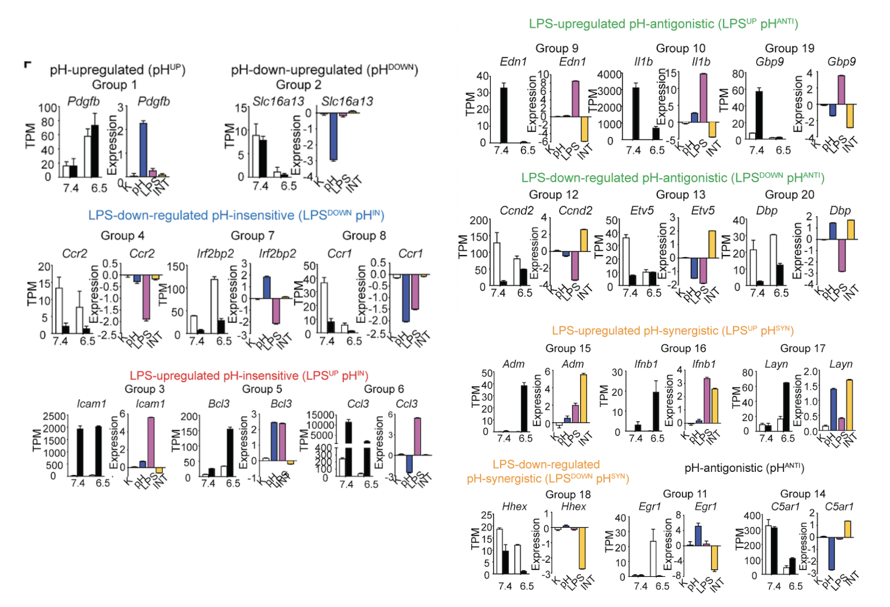

Mammalian tissues comprise intricate networks of interacting cells that dynamically respond to physiological and pathological changes in the tissue microenvironment. A diverse array of signals, including cellular factors (e.g. growth factors, cytokines, metabolites), chemical cues (e.g. pH, O2, osmolarity) and physical stimuli (e.g. space constraints, stiffness), regulates essential processes such as cellular growth, differentiation, migration, and adaptive responses.

For tissues to function optimally, cells must simultaneously detect and integrate these heterogeneous inputs, orchestrating coordinated programs for organ development, tissue repair and defense against noxious stimuli. Importantly, the integrated response often transcends the simple sum of individual pathways, reflecting the epistatic nature of complex signaling and gene regulatory networks. Despite this, most investigations have focused on single stimuli or perturbations, leaving a critical gap in our understanding of how cells collectively and quantitatively process multifaceted signals.

Using the primordial version of LinSig, our work (Wu et. al, Cell 2025) has found that acidic pH environment substantially impact how macrophages respond to the microbial cues (Lipopolysaccharide, LPS). This model conceptualizes that two signals, such as LPS stimulation and acidic pH, control gene expression through three possible logics: LPS regulation independent of pH (LPS), pH regulation independent of LPS (pH), and the synergistic or antagonistic regulation between LPS and pH (INT). The combinations of these three regulations (referred to as “expression components”) contribute to gene expression among all experimental conditions (Figure 1). Applying a linear deconvolution model allows assessing them simultaneously and quantitatively for each gene (Figure 2).  

_Figure 1. Linear deconvolution model for combinatorial regulations between LPS and pH._ 

_Figure 2. Linear deconvolution matrix for dissecting the interactions between LPS and pH._ 

Overall, more than 92% of differentially expressed genes were well captured using the 3-component linear model (R2 > 0.9) (Figure 3). 1620 genes have at least one significant expression component (p<0.05) forming 20 clusters (>5 genes) (Figure 4). For example, among genes regulated by LPS and pH independently (cluster 1-8), Nfkbib, Nfkbid, Nfkbie (Cluster 3) and Nfkbia, Nkfbiz (Cluster 5) are all induced by LPS independent of pH, despite having differences in pH-dependent basal expression. Cluster 9-14 include genes regulated antagonistically by pH and LPS, including inflammatory cytokines (Il6, Il12a, Il12b, Il18), chemokines (Ccl5, Ccl8, Ccl12, Cxcl9, Cxcl10, Cxcl11), acute phase proteins (Oas1, Oas2, Oas3, Saa3) and inflammatory effectors (Edn1, Nos2). At last, group 15-18 include genes synergistically regulated by LPS and acidic pH, such as Adm, Ifnb1, Tnfsf9, Il23a and Adora2b.

_Figure 3. Heatmap of inflammatory genes with model-inferred expression components (left) and p-value (right)._ 

_Figure 4. Gene examples of 20 clusters identified by gene expression components._

This results help review how acidic pH specifically alters the inflammatory response trigger by LPS in macrophages, such as distinct pH-dependent immune functions (Figure 5).

_Figure 5. Functional enrichment of pH-insensitive, pH-antagonistic or pH-synergistic genes._ 

These differentially expression lead to our discovery that BRD4 condensates act as pH senor to tune inflammation. (Figure 6)

_Figure 6: STED imaging of BRD4 and MED1 condensates in BMDMs. At pH 7.4, endogenous BRD4 and MED1 formed condensates and co-localized in BMDMs. At pH 6.5, however, these condensates were substantially reduced. The remaining puncta of BRD4 and MED1 were partitioned spatially, contrasting with the strong colocalization seen at pH 7.4. This leads to disruption of transcriptional condensates that are critical for gene activation._ 

